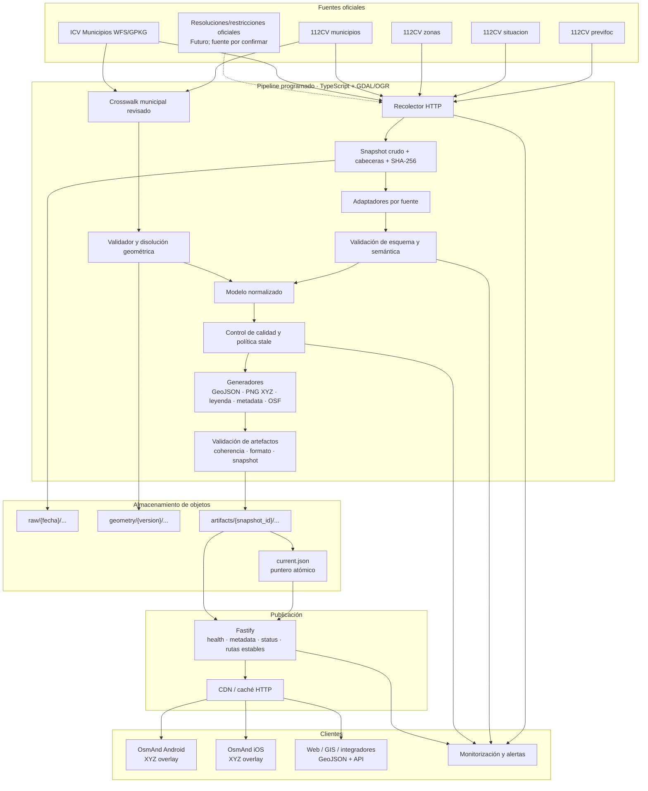
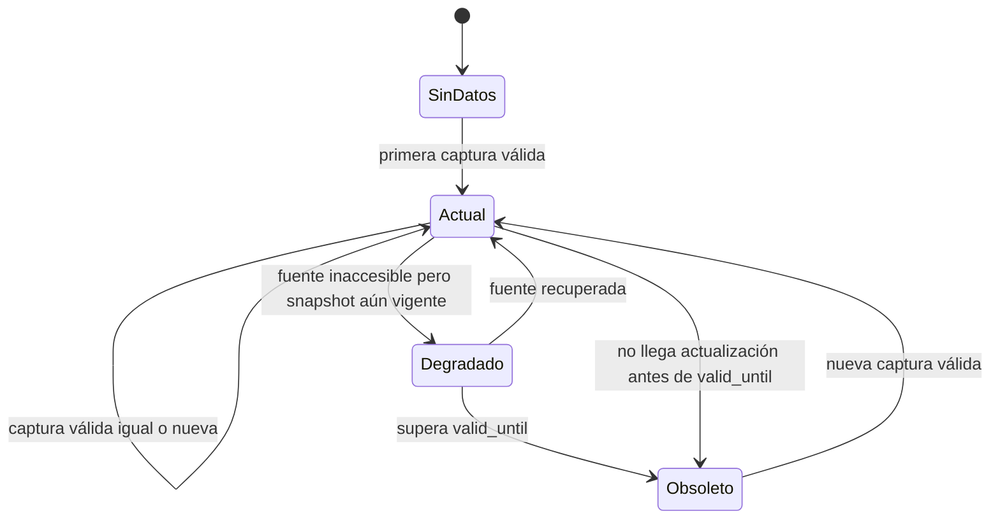

# Arquitectura de referencia

## Decisión de alto nivel

Se recomienda una arquitectura **híbrida y static-first**:

- un pipeline TypeScript programado descarga, valida, normaliza y genera artefactos;
- un almacenamiento de objetos conserva snapshots versionados y la última versión válida;
- Fastify publica rutas estables, resuelve consultas espaciales y selecciona atómicamente la versión activa;
- una CDN cachea teselas y documentos públicos;
- OsmAnd consume únicamente XYZ; GeoJSON y la API quedan disponibles para otros clientes y para funciones futuras.

Esta arquitectura corresponde a la alternativa E. Evita depender de que OsmAnd entienda datos vectoriales dinámicos, sin perder una representación vectorial canónica.

## Diagrama



La publicación se hace escribiendo primero todos los objetos de `artifacts/{snapshot_id}/` y, solo tras verificarlos, sustituyendo `current.json`. Una petición a `/tiles/...` se resuelve contra el snapshot indicado por ese puntero. Así no se mezclan teselas de dos estados durante una actualización.

## Componentes

### 1. Recolector oficial

Responsabilidades:

- GET con TLS, timeout de conexión y lectura, reintentos acotados y backoff con jitter;
- `User-Agent` identificable y correo de contacto;
- registro de URL, código HTTP, cabeceras, cuerpo, tiempo UTC y duración;
- SHA-256 del cuerpo crudo y hash semántico del contenido normalizado;
- respeto de `Cache-Control` y `Retry-After` cuando exista;
- sanitización de logs para no registrar secretos, aunque las fuentes actuales sean públicas.

Cadencia inicial:

- `previfoc`: cada 15 minutos;
- `situacion`, `zonas`, `municipios`: una vez al día;
- geometría ICV: comprobar metadatos semanalmente y refrescar mensualmente o al cambiar.

El recolector nunca publica directamente. Deposita un candidato que deben aprobar los validadores.

### 2. Adaptadores

Un adaptador por contrato externo:

- `PrevifocAdapter` conserva `time` original, separa hoy/mañana y resuelve `nact`/`npre`.
- `SituacionAdapter` filtra `ID_AVISO = 3`, exige activo y traduce la combinación nivel/tormenta a códigos internos estables.
- `ZonasAdapter` resuelve exclusivamente los siete identificadores configurados.
- `Municipios112Adapter` excluye `Fuera C.V.` y entrega asignaciones de zona, sin inventar código INE.
- `MunicipiosICVAdapter` lee GPKG/WFS, conserva código oficial, CRS, versión y licencia.
- `RestrictionAdapter` queda como interfaz futura; no debe implementarse hasta localizar fuentes oficiales y reglas jurídicas verificables.

Los adaptadores aceptan campos adicionales con aviso, para no caer ante una ampliación compatible, pero rechazan campos obligatorios ausentes, tipos alterados o relaciones rotas.

### 3. Normalización y modelo canónico

El modelo normalizado no expone el formato del 112CV. Se detalla en `PLAN.md`. Reglas esenciales:

- una entidad por zona y periodo (`current` y `forecast_next_day`);
- nivel de riesgo separado de tormenta seca;
- estado de circulación separado de ambos;
- fechas fuente y derivadas marcadas con procedencia;
- geometría versionada, no repetida en el historial de estados;
- todo valor legal acompañado de autoridad, URL, vigencia y ámbito.

### 4. Geometrías

Pipeline geométrico:

1. cargar el GPKG oficial en EPSG:25830;
2. validar la tabla de correspondencia a código municipal;
3. exigir 542 asignaciones únicas y siete zonas;
4. comprobar/reparar geometrías de forma controlada;
5. disolver por zona conservando multipolígonos y enclaves;
6. verificar ausencia de solapes entre zonas y equivalencia de la cobertura total;
7. producir una versión maestra en GPKG/EPSG:25830;
8. derivar GeoJSON EPSG:4326 y una copia EPSG:3857 para render;
9. simplificar por zoom solo para render, nunca sustituir la maestra;
10. comparar visualmente con el mapa oficial.

La tabla de correspondencia debe ser un artefacto revisable con columnas como:

```text
source_name, source_zone_id, cod_ine_mun, icv_name, match_method,
reviewed_by, reviewed_at, source_hash
```

No se permite publicar si hay coincidencias aproximadas sin revisar.

### 5. Validación

#### Estructural

- JSON parseable y `Content-Type` compatible;
- esquemas Zod exportables a JSON Schema por fuente;
- cadenas y números dentro de dominios conocidos;
- `time` parseable conservando el original.

#### Semántica

- conjunto de zonas exactamente `{53,54,55,56,57,58,59}` para el contrato actual;
- siete filas `z1`, sin duplicados;
- cada `nact` y `npre` resuelve a situación PREVIFOC activa;
- 542 municipios valencianos asignados una sola vez;
- toda zona tiene al menos un municipio;
- ningún nivel fuera de 1–3 tras la traducción;
- `time` no excesivamente futuro respecto de recuperación; tolerancia configurable.

#### Geométrica

- geometrías válidas y no vacías;
- siete MultiPolygon;
- cobertura total equivalente a los municipios fuente dentro de tolerancia;
- intersecciones entre zonas solo en fronteras, sin área apreciable;
- bbox dentro de la Comunitat Valenciana;
- muestra de puntos por municipio devuelve su zona asignada.

#### Artefactos

- GeoJSON conforme a RFC 7946, coordenadas lon/lat;
- teselas de muestra decodificables, 256×256, canal alpha;
- tesela fuera de cobertura transparente;
- leyenda contiene nivel, texto, símbolo y actualización;
- `.osf` importable en pruebas Android/iOS;
- todos los artefactos comparten `snapshot_id` y `geometry_version`.

### 6. Almacenamiento

Para el MVP no se necesita PostGIS.

Estructura lógica:

```text
raw/2026/07/17/{retrieval_id}/previfoc.json
raw/2026/07/17/{retrieval_id}/headers.json
geometry/{geometry_version}/municipios.gpkg
geometry/{geometry_version}/zones-master.gpkg
geometry/{geometry_version}/crosswalk.csv
artifacts/{snapshot_id}/metadata.json
artifacts/{snapshot_id}/zones.geojson
artifacts/{snapshot_id}/zones/{zone_id}.json
artifacts/{snapshot_id}/tiles/{z}/{x}/{y}.png
artifacts/{snapshot_id}/legend.png
artifacts/{snapshot_id}/previfoc.osf
current.json
```

`current.json` contiene solo un snapshot que ha pasado todas las pruebas. Los snapshots crudos permiten auditar qué se publicó. La retención del cuerpo crudo debe confirmarse con las condiciones de reutilización; propuesta inicial: 90 días, más metadatos y hashes indefinidos.

PostGIS se introduce únicamente cuando ocurra al menos una de estas condiciones:

- restricciones por miles de pistas, espacios o polígonos con vigencias solapadas;
- consulta de rutas y buffers a volumen significativo;
- edición/validación multiusuario;
- necesidad de consultas históricas espaciales complejas.

### 7. Generadores

- `zones.geojson`: geometría canónica simplificada de forma conservadora y propiedades normalizadas.
- `metadata.json`: fuente, versión, vigencia, calidad, stale, atribución y avisos.
- `tiles`: PNG32 en z6–14, precomputadas solo al cambiar el snapshot.
- `legend.png`: misma simbología que las teselas, texto accesible, fecha y aviso no oficial.
- `previfoc.osf`: configuración estable de la fuente; no incrusta el estado diario.

Tecnología propuesta:

- TypeScript sobre Node.js LTS para orquestación, contratos, generación de artefactos y publicación;
- Zod para validar contratos externos e inferir los tipos internos;
- GDAL/OGR mediante `ogrinfo` y `ogr2ogr` para GPKG/WFS, validez, disolución, simplificación y reproyección; se invoca como proceso externo con argumentos controlados, sin bindings nativos de Node;
- Turf para operaciones GeoJSON ligeras en runtime, especialmente bbox y punto-en-polígono sobre solo siete zonas;
- SVG por metatiles y Sharp para el candidato de render PNG32, con recorte, buffer y golden tests contra seams; `geojson-vt` puede usarse para indexado, simplificación y clipping por zoom.

El render SVG + Sharp debe superar un benchmark en la Fase 3 antes de quedar fijado. Si no cumple calidad, determinismo o tiempo, se sustituirá solo ese adaptador por un renderizador cartográfico dedicado, sin cambiar el dominio TypeScript ni los contratos de artefactos. Tippecanoe no es necesario para el MVP porque produce teselas vectoriales que OsmAnd no consumiría como overlay ráster. MapLibre sería útil en una web, pero añadir render GL en servidor no simplifica siete polígonos. GDAL sigue siendo necesario para formatos, CRS y topología robusta.

### 8. API Fastify

Fastify carga en memoria el snapshot apuntado por `current.json` y los siete MultiPolygon. Un prefiltro por bbox y Turf resuelven la consulta puntual sin necesidad de mantener un índice espacial complejo. Funciones:

- rutas de salud y metadatos;
- `/status` punto-en-polígono;
- rutas estables a artefactos versionados;
- cabeceras correctas, ETag y validación de parámetros;
- respuesta segura cuando los datos estén stale.

Fastify se elige por su integración con TypeScript, validación/serialización basada en esquemas y bajo coste operativo. Zod conserva una única definición para validación y tipos, y el contrato OpenAPI se genera mediante un adaptador Zod → JSON Schema. El procesamiento GIS robusto queda tras un adaptador de comandos GDAL/OGR, por lo que no obliga a introducir Python ni a acoplar el dominio a bindings nativos.

### 9. Caché HTTP

| Recurso | Política propuesta |
|---|---|
| `/health` | `no-store` |
| `/metadata.json` | `public, max-age=60, stale-if-error=600`; ETag de snapshot |
| `/zones.geojson` y zona individual | `public, max-age=300, stale-if-error=86400`; ETag |
| `/status` | `no-store` o `private, max-age=60`; no cachear respuestas personalizadas a largo plazo |
| `/tiles/...` estable | `public, max-age=300, stale-if-error=86400`; ETag de snapshot + coordenada |
| objeto versionado interno | `public, max-age=31536000, immutable` |
| `/legend.png` | `public, max-age=300`; ETag |
| `.osf` | `public, max-age=86400`; la URL XYZ interna permanece estable |

Cuando cambia `current.json`, se purga la caché de metadatos, leyenda y teselas actuales si el proveedor lo permite. Aun así, el TTL corto limita la mezcla. Los objetos versionados no se sobrescriben.

El tiempo de expiración configurado en OsmAnd debe ser 15 minutos, validado en dispositivos. Es independiente del `Cache-Control` del servidor.

### 10. Tolerancia a fallos y obsolescencia

Estados del pipeline:



Política:

- una caída no borra la última versión válida;
- mientras siga dentro de su periodo de vigencia, se marca `source_unreachable=true` pero no necesariamente `is_stale`;
- al superar `valid_until`, `is_stale=true` inmediatamente; no se “promueve” automáticamente la previsión de ayer;
- si la fuente no aporta vigencia explícita, el límite diario se deriva y se marca como inferido;
- tras 30 minutos de fallos consecutivos, alerta operativa;
- si a las 00:30 Europe/Madrid no existe snapshot para el nuevo día, alerta de actualidad;
- con datos stale, GeoJSON/API siguen respondiendo con banderas y advertencias, y las teselas usan trama gris y texto `DATOS OBSOLETOS`;
- si nunca hubo snapshot válido, API/teselas devuelven `503` o una tesela de “sin datos”, nunca un mapa vacío que parezca seguro.

El valor exacto de 00:30 debe ajustarse tras observar dos semanas de publicaciones reales.

### 11. Monitorización

Métricas y checks:

- estado y latencia de cada fuente;
- edad de `source_updated_at` y último éxito de recuperación;
- hash de esquema y conteos de filas;
- IDs de zona/situación no resueltos;
- municipios no asociados o duplicados;
- errores topológicos y diferencia de área;
- duración y número de teselas generadas;
- tamaño total de artefactos;
- canarios HTTP para una tesela conocida, GeoJSON, leyenda y `/status`;
- porcentaje de `5xx`, latencia API y aciertos de CDN;
- snapshot activo, versión geométrica e indicador stale.

Alertas:

- inmediata: esquema incompatible, zona desconocida, geometría inválida, publicación parcial, no existe snapshot válido;
- 15–30 min: fuente dinámica caída o nueva fecha no publicada;
- diaria: catálogos estáticos inaccesibles;
- informativa: campo adicional, cambio de hash sin cambio semántico, nueva versión ICV.

Canales concretos se decidirán en despliegue. Debe existir al menos correo y un monitor externo independiente del proveedor principal.

### 12. Pruebas automáticas

- unitarias para cada adaptador con fixtures reales anonimizados solo si la licencia lo permite;
- contract tests que consultan fuentes sin publicar;
- propiedades topológicas sobre los 542 municipios;
- golden tests de siete teselas representativas y leyenda;
- prueba de idempotencia: misma entrada produce mismo snapshot/hash;
- prueba de publicación atómica y rollback del puntero;
- prueba stale con reloj inyectable;
- prueba de `status` en interior, frontera, enclave, mar y fuera de cobertura;
- fuzzing de lat/lon y parámetros de tesela;
- smoke tests del `.osf` en Android/iOS, inicialmente manuales y registrados por versión.

## Despliegue recomendado para MVP

### Opción recomendada

- **Render**: un servicio web Fastify y un Cron Job TypeScript que usan la misma imagen Docker.
- **Cloudflare R2**: snapshots y artefactos versionados mediante API compatible con S3.
- **Cloudflare CDN** delante del dominio de la API: caché de teselas y JSON; R2 queda privado.
- **GitHub Actions**: lint, tests, construcción de imagen y despliegue; no como único planificador de producción.

Render documenta trabajos cron aislados y garantía de una sola ejecución activa. Sus sistemas de ficheros son efímeros y los cron no pueden usar disco persistente, por lo que R2 es parte deliberada del diseño, no un añadido. Docker fija Node.js, GDAL/OGR y las dependencias nativas de Sharp, y mantiene portabilidad.

### Evaluación de plataformas

| Plataforma | Uso recomendado | Motivo / límite |
|---|---|---|
| GitHub Actions | CI y POC programada | Muy cómodo, pero los `schedule` pueden retrasarse o descartarse con carga; no debe ser el único recolector de seguridad |
| Cloudflare Pages | Página informativa estática opcional | No es el lugar natural para miles de teselas versionadas y procesamiento GIS |
| Cloudflare Workers | Futuro proxy de borde o recolector ligero | Cron y R2 son adecuados, pero GDAL y Sharp/libvips no encajan en ese runtime; duplicaría el entorno del MVP |
| Cloudflare R2 | Sí, almacenamiento | Objetos versionados, S3 compatible y buen encaje con CDN; usar dominio propio/Worker, no `r2.dev` en producción |
| Render | **Sí, primera opción MVP** | Web + cron Docker; single-run; R2 resuelve su almacenamiento efímero |
| Railway | Alternativa válida | Web + cron en un proyecto; mínimo 5 min, ejecución puede variar y se salta un run si el anterior sigue activo |
| Fly.io | Alternativa si ya se domina | Excelente para contenedores, pero el cron requiere Cron Manager/Supercronic o intervalos básicos; más plumbing |
| AWS | Fase de escala/SLA | EventBridge + Fargate/Lambda + S3/CloudFront es robusto, pero IAM, observabilidad y coste operativo son excesivos para siete zonas |

No debe dependerse de una característica gratuita concreta ni de precios actuales. La imagen Docker, el almacenamiento S3 compatible y los contratos HTTP permiten migrar.

## Escalabilidad

El área y número de zonas son pequeños. La mayor carga son las teselas, absorbida por CDN. Escalado esperado:

1. precomputar z6–14 solo cuando cambia el snapshot;
2. almacenar inmutablemente y cachear;
3. cargar siete MultiPolygon e índice espacial en memoria por instancia;
4. añadir réplicas Fastify solo si `/status` lo exige;
5. introducir PostGIS y cola de trabajos únicamente al añadir restricciones granulares o rutas masivas.

## Estructura de directorios propuesta

No se crea todavía; es la estructura para implementación:

```text
src/
  collectors/
  adapters/
  domain/
  geometry/
  render/
  publish/
  api/
  cli/
schemas/
styles/
data/
  crosswalk/
tests/
  fixtures/
  golden/
ops/
  docker/
  gdal/
docs/
package.json
tsconfig.json
```

## Supuestos que requieren confirmación

1. Las zonas son uniones exactas de municipios completos.
2. `time` usa Europe/Madrid y representa la publicación oficial.
3. La publicación es diaria cerca de medianoche y las correcciones intradía son posibles.
4. El 112CV permite esta reutilización y cadencia.
5. No existe una fuente geográfica PREVIFOC oficial más directa.
6. El MVP puede mostrar riesgo sin afirmar permisos de circulación mientras no haya fuente jurídica estructurada.
