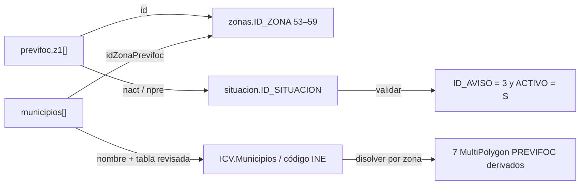

# Fuentes de datos PREVIFOC

Fecha de inspección: **2026-07-17**, zona horaria de la inspección: **Europe/Madrid**.

Este documento separa:

- **Verificado**: observado directamente en una respuesta HTTP o en código publicado por la web oficial.
- **Inferencia**: conclusión razonable que aún debe confirmarse con el organismo responsable.
- **Recomendación**: decisión propuesta para el futuro sistema.

## Resumen ejecutivo

**Verificado.** Los cuatro JSON indicados son públicos y respondieron `200 OK`, pero ninguno contiene coordenadas, polígonos ni otra geometría. La web oficial no carga una capa vectorial: descarga esos JSON y muestra dos JPEG ya renderizados, uno para hoy y otro para mañana.

**Verificado.** El endpoint `municipios` contiene los 542 municipios de la Comunitat Valenciana, más el elemento especial `Fuera C.V.`, y asigna cada municipio a una de las siete zonas PREVIFOC. El catálogo oficial del ICV publica los polígonos municipales mediante WFS, WMS, GPKG y SHP bajo **CC BY 4.0 Generalitat**.

**Inferencia de alta confianza.** Los polígonos PREVIFOC pueden reconstruirse disolviendo los límites municipales oficiales según `idZonaPrevifoc`. Esta geometría será derivada de dos fuentes oficiales, pero no debe describirse como una capa PREVIFOC publicada oficialmente hasta obtener confirmación del 112CV. Debe compararse con los mapas oficiales antes de usarla.

## Inventario de endpoints 112CV

| Recurso | HTTP | `Content-Type` | Tamaño observado | Caché observada | Geometría |
|---|---:|---|---:|---|---|
| [`previfoc`](https://wpr.112cv.gva.es/external/api/storage/descargar/json/previfoc) | 200 | `application/json` | 1.965 B | `no-store, no-cache, must-revalidate, max-age=0`; `Pragma: no-cache`; `Expires: 0` | No |
| [`situacion`](https://wpr.112cv.gva.es/external/api/storage/descargar/json/static/situacion) | 200 | `application/json` | 3.710 B | `public, max-age=43200` | No |
| [`zonas`](https://wpr.112cv.gva.es/external/api/storage/descargar/json/static/zonas) | 200 | `application/json` | 6.319 B | `public, max-age=43200` | No |
| [`municipios`](https://wpr.112cv.gva.es/wp/api/municipios) | 200 | `application/json` | 49.694 B | Sin `Cache-Control`, `ETag` ni `Last-Modified`; transferencia `chunked` | No |
| [Imagen de referencia de las zonas](https://wpr.112cv.gva.es/external/api/storage/descargar/imagen/static/images/avisosmeteorologicos/zonasprevifoc.png) | 200 | `image/png` | 44.982 B; 500×835 px | `public, max-age=43200` | Imagen no georreferenciada |

Los cuatro JSON incluían `Vary: Origin`, `Vary: Access-Control-Request-Method` y `Vary: Access-Control-Request-Headers`. No se observaron `ETag`, `Last-Modified`, `Age`, `Retry-After` ni cabeceras de límite de peticiones en estos recursos. Que no se anuncie un límite no significa que no exista.

Los recursos `previfoc`, `situacion` y `zonas` incluyeron `Content-Disposition: inline; filename="…json"` y `Accept-Ranges: bytes`. La respuesta de `municipios` no incluyó `Content-Length`.

### `previfoc`

Esquema observado:

```text
object
├── c: string
├── v: integer
├── t: integer
├── z1: array<object>
│   ├── id: integer
│   ├── nact: integer
│   └── npre: integer
├── time: string, formato observado "YYYY-MM-DD HH:mm:ss.S"
├── desEs: string con HTML
├── desVa: string con HTML
├── desPreEs: string con HTML
├── desPreVa: string con HTML
└── isFileAH: boolean
```

Ejemplo real abreviado, sin modificar valores:

```json
{
  "c": "1",
  "v": 5,
  "t": 3,
  "z1": [
    { "id": 54, "nact": 8, "npre": 5 },
    { "id": 55, "nact": 4, "npre": 4 },
    { "id": 56, "nact": 8, "npre": 8 },
    { "id": 53, "nact": 5, "npre": 5 },
    { "id": 58, "nact": 8, "npre": 8 },
    { "id": 59, "nact": 7, "npre": 4 },
    { "id": 57, "nact": 4, "npre": 4 }
  ],
  "time": "2026-07-17 00:00:02.0",
  "desEs": "<p>…</p>",
  "desVa": "<p>…</p>",
  "desPreEs": "<p>…</p>",
  "desPreVa": "<p>…</p>",
  "isFileAH": false
}
```

**Verificado en el JavaScript oficial.** `nact` es el identificador de situación para hoy y `npre` el de la previsión de mañana. No son directamente el nivel 1, 2 o 3. La web resuelve ambos contra `situacion` y deriva el nivel del texto o, como respaldo, mediante bloques de tres identificadores.

**No verificado.** No se encontró documentación pública que explique `c`, `v`, `t` o `isFileAH`. El sistema no debe asignarles significado hasta confirmarlo. Tampoco debe interpretar las descripciones HTML sin sanearlas.

**Fecha y vigencia.** `time` se presenta en la web como “Última modificación”. No incluye desplazamiento UTC ni nombre de zona horaria. Es razonable tratarlo provisionalmente como hora local de la Comunitat Valenciana, conservando también el valor original, pero esto requiere confirmación. El JSON no contiene `valid_from` ni `valid_until` explícitos.

### `situacion`

Esquema observado:

```text
object
└── SITUACION: array<object>
    ├── ID_SITUACION: integer
    ├── DESCRIPCION_ES: string
    ├── DESCRIPCION_VA: string
    ├── COLOR: null en las 17 filas observadas
    ├── FECHA_ALTA: string ISO 8601 con Z
    ├── FIRMA_USUARIO: string
    ├── ID_AVISO: integer
    └── ACTIVO: string, valor observado "S"
```

Las nueve situaciones de incendio (`ID_AVISO = 3`) observadas son:

| `ID_SITUACION` | Descripción ES | Nivel derivado | Tormenta seca |
|---:|---|---:|---|
| 1 | Nivel 1 y sin riesgo tormentas | 1 | Sin riesgo |
| 2 | Nivel 1 y posibilidad de tormentas secas | 1 | Posible |
| 3 | Nivel 1 y alto riesgo de tormentas seca | 1 | Alto |
| 4 | Nivel 2 y sin riesgo tormentas | 2 | Sin riesgo |
| 5 | Nivel 2 y posibilidad de tormentas secas | 2 | Posible |
| 6 | Nivel 2 y alto riesgo de tormentas secas | 2 | Alto |
| 7 | Nivel 3 y sin riesgo tormentas | 3 | Sin riesgo |
| 8 | Nivel 3 y posibilidad de tormentas secas | 3 | Posible |
| 9 | Nivel 3 y alto riesgo de tormentas secas | 3 | Alto |

El mismo catálogo contiene filas de otros tipos de aviso:

- `ID_AVISO = 1`: verde, amarillo, naranja y rojo.
- `ID_AVISO = 2`: situaciones 0, 1, 2 y 3.
- `ID_AVISO = 3`: las nueve combinaciones PREVIFOC.

Por tanto, el adaptador debe comprobar `ID_AVISO = 3` y `ACTIVO = "S"`, no resolver un identificador sin validar su categoría.

### `zonas`

Esquema observado:

```text
array<object>
├── ID_ZONA: integer
├── DESCRIPCION_ES: string
├── DESCRIPCION_VA: string
└── ID_PROVINCIA: integer | null
```

El array contenía 60 filas en total. Las siete zonas usadas por `previfoc.z1` son:

| `ID_ZONA` | Código mostrado |
|---:|---|
| 53 | `1N` |
| 54 | `1S` |
| 55 | `2` |
| 56 | `3` |
| 57 | `4` |
| 58 | `5` |
| 59 | `6` |

Los valores observados en `DESCRIPCION_ES`/`DESCRIPCION_VA` para estas zonas incluyen un espacio final, por ejemplo `"1N "` y `"6 "`; la tabla anterior los muestra recortados. El adaptador debe conservar el valor crudo para auditoría y aplicar `trim` únicamente al código normalizado.

El catálogo `zonas` no es exclusivo de PREVIFOC. También contiene zonas meteorológicas, zonas de emergencia, provincias completas y zonas de costa. El conjunto exacto `{53, 54, 55, 56, 57, 58, 59}` debe ser una invariante explícita del adaptador PREVIFOC, no una selección basada solo en rangos futuros.

### `municipios`

Esquema observado:

```text
array<object>
├── municipio: string
├── idZonaPrevifoc: integer
├── idZonaAvisoMeteo: integer
└── idZonaEmergencia: integer
```

Ejemplo real:

```json
{
  "municipio": "Ademuz",
  "idZonaPrevifoc": 56,
  "idZonaAvisoMeteo": 9,
  "idZonaEmergencia": 21
}
```

Conteos observados:

| `idZonaPrevifoc` | Código | Municipios |
|---:|---|---:|
| 53 | 1N | 28 |
| 54 | 1S | 64 |
| 55 | 2 | 40 |
| 56 | 3 | 113 |
| 57 | 4 | 61 |
| 58 | 5 | 190 |
| 59 | 6 | 46 |
| 0 | Fuera C.V. | 1 elemento especial |

Las siete zonas suman **542 municipios**. El elemento especial es:

```json
{
  "municipio": "Fuera C.V.",
  "idZonaPrevifoc": 0,
  "idZonaAvisoMeteo": 0,
  "idZonaEmergencia": 0
}
```

El endpoint no ofrece código INE. Los nombres incluyen artículos pospuestos y denominaciones bilingües, por ejemplo `Alacant/Alicante` o `Alcora, l'`. No es seguro unir automáticamente por igualdad textual con otra cartografía. Debe crearse una tabla de correspondencia versionada y revisada que asigne cada fila a un código municipal oficial.

## Relaciones verificadas



Relación operacional:

1. `previfoc.z1[].id` identifica la zona 112CV.
2. `zonas.ID_ZONA` aporta el código legible de la zona.
3. `nact` y `npre` identifican una fila de `situacion`; solo las filas de `ID_AVISO = 3` son PREVIFOC.
4. `municipios.idZonaPrevifoc` asigna un municipio a la zona.
5. La geometría municipal oficial aporta el polígono; al disolver por zona se obtiene la geometría derivada.

## Frecuencia aparente de actualización

- **`previfoc`**: la única muestra observada tenía hora `00:00:02` y contiene hoy y mañana. Esto es compatible con una publicación diaria, pero una sola observación no permite afirmar la cadencia ni descartar correcciones intradía. La ausencia deliberada de caché indica que el publicador espera lecturas actuales.
- **`situacion` y `zonas`**: el servidor autoriza 12 horas de caché y los datos son catálogos. Deben consultarse como máximo una vez al día, o cuando cambie su huella.
- **`municipios`**: sin indicación de caché. Su naturaleza es de catálogo; una descarga diaria es suficiente para detectar cambios, guardando la última versión válida.
- **Recomendación**: observar `previfoc` cada 15 minutos durante al menos 14 días en Fase 0, registrar `time`, hash, cabeceras y cambios. No regenerar ni publicar si la semántica no cambia.

## Inspección de la web oficial

Página inspeccionada: [Incendios forestales — 112CV](https://www.112cv.gva.es/es/incendios-forestales).

La página carga este lanzador:

```text
https://wpr.112cv.gva.es/external/api/storage/descargar/js/static/dist/vanilla/liferay/incendios.js
```

El lanzador monta `incendios.html`. El componente descargado llama exactamente a:

```text
/external/api/storage/descargar/json/static/zonas
/external/api/storage/descargar/json/static/situacion
/external/api/storage/descargar/json/previfoc
/wp/api/municipios
```

Y muestra estas imágenes:

```text
/external/api/storage/descargar/imagen/previfoc/previfoc.jpeg
/external/api/storage/descargar/imagen/previfoc/previfoc_prevision.jpeg
/external/api/storage/descargar/imagen/static/images/avisosmeteorologicos/zonasprevifoc.png
```

También enlaza el [PDF diario PREVIFOC](https://wpr.112cv.gva.es/external/api/storage/descargar/pdf/previfoc/previfoc.pdf).

**Verificado.** El componente no solicita GeoJSON, WMS, WFS, ArcGIS REST, KML, shapefile ni otro recurso geométrico. Los mapas de hoy y mañana son JPEG estáticos. No se encontró una geometría oculta en la implementación web actual.

## Investigación de geometría

### Alternativa 1 — geometría en los endpoints 112CV

- **Resultado**: descartada.
- **Precisión/formato**: no aplicable; solo atributos.
- **Mantenimiento**: no aplicable.
- **Riesgo**: inventar una geometría que la fuente no proporciona.

### Alternativa 2 — geometría cargada por la web oficial

- **Resultado**: no encontrada.
- **Fuente revisada**: HTML de la página, lanzador `incendios.js` y componente `incendios.html`.
- **Formato usado realmente**: JPEG/PNG no georreferenciados.
- **Riesgo**: la implementación puede cambiar sin aviso porque estos recursos no forman una API documentada.

### Alternativa 3 — servicios geográficos oficiales

Se revisó el índice público de servicios del ICV y el servicio oficial de [Prevención de incendios](https://carto.icv.gva.es/arcgis/rest/services/tm_medio_ambiente/prevencion_de_incendios/MapServer). Este último publica numerosas capas forestales, pero no se encontró una capa denominada PREVIFOC o de preemergencia diaria. La ausencia en el catálogo público no demuestra que no exista una fuente interna; conviene preguntarlo al 112CV/ICV.

Sí existe cartografía municipal oficial adecuada:

- [Conjunto “Delimitación territorial: Municipios de la Comunitat Valenciana”](https://dadesobertes.gva.es/es/dataset/delimitacion-territorial-municipios-de-la-comunitat-valenciana).
- [WFS oficial](https://terramapas.icv.gva.es/0105_Delimitaciones?service=WFS&request=GetCapabilities).
- [WMS oficial](https://terramapas.icv.gva.es/0105_Delimitaciones?service=WMS&request=GetCapabilities).
- [ArcGIS REST alternativo](https://carto.icv.gva.es/arcgis/rest/services/0105_delimitaciones/0105_Delimitaciones/MapServer/0).

Características verificadas del WFS:

- WFS 2.0.0.
- Tipo `ms:ICV.Municipios` (`ICV.Municipios` en las URLs de descarga del catálogo).
- CRS predeterminado EPSG:25830; también ofrece EPSG:3857 y EPSG:4326, entre otros.
- Condición de acceso declarada: `CC BY 4.0 Generalitat`.
- Sin tasa anunciada en `GetCapabilities`.

El catálogo describe los recintos como resultado de líneas municipales inscritas en el Registro Central de Cartografía, mejoras geométricas del ICV y costa de la cartografía 1:5.000 del ICV. En la consulta del 2026-07-17 el recurso declaraba última modificación `2026-06-16` y el catálogo había sido modificado `2026-07-16`.

| Opción oficial | Precisión | Formato | Licencia | Mantenimiento | Riesgo de desalineación PREVIFOC |
|---|---|---|---|---|---|
| WFS/GPKG municipal ICV + disolución | Alta; límites oficiales y costa ICV 1:5.000 | WFS, GPKG, SHP; salida propia GeoJSON | CC BY 4.0 Generalitat | Baja-media; refresco mensual y tabla de correspondencia | Medio-bajo, pendiente de probar que PREVIFOC coincide exactamente con municipios |
| ArcGIS REST municipal ICV + disolución | Alta; 542 polígonos, GeoJSON disponible | ArcGIS JSON/GeoJSON, EPSG:3857 o 4326 | El servicio REST no rellena `copyrightText`; usar la licencia del conjunto catalogado y confirmar que es el mismo producto | Baja-media | Igual que WFS; preferir el recurso catalogado para trazabilidad de licencia |
| WMS municipal | Misma fuente, pero imagen | PNG/JPEG vía WMS | CC BY 4.0 Generalitat | Baja | No permite por sí solo asignar estados ni disolver de forma fiable |

### Alternativa 4 — reconstrucción municipal

**Recomendada para el MVP, con validación previa.**

Procedimiento previsto:

1. Descargar el GPKG oficial `ICV.Municipios` y registrar hash, metadatos y fecha.
2. Descargar `municipios` del 112CV.
3. Construir una tabla de correspondencia `source_name → cod_ine_mun`, utilizando aliases y revisión humana; nunca resolver silenciosamente por coincidencia aproximada.
4. Excluir exclusivamente `Fuera C.V.`.
5. Exigir 542 municipios asignados una sola vez, siete zonas no vacías y ningún identificador fuera de 53–59.
6. Reparar solo geometrías inválidas con una operación documentada; conservar el original.
7. Disolver por `idZonaPrevifoc`, mantener multipolígonos y enclaves, y no rellenar huecos.
8. Comprobar que la unión de las siete zonas coincide topológicamente con la unión de los 542 municipios dentro de tolerancia.
9. Renderizar la geometría y compararla con `previfoc.jpeg`, `previfoc_prevision.jpeg` y `zonasprevifoc.png`.
10. Solicitar confirmación al 112CV/ICV de que las zonas se definen por municipios completos.

Calidad que debe publicarse: `geometry_source = "ICV.Municipios"` y `geometry_quality = "derived_from_official_municipal_assignment"`, no `official_previfoc_polygon`.

Riesgos principales:

- cambio de nombre municipal que rompa la correspondencia;
- alta/baja/fusión municipal;
- discrepancia entre la cartografía usada para generar el JPEG oficial y la versión actual del ICV;
- enclave o isla mal tratada durante el disolvido;
- que una zona oficial no siga exactamente el término municipal pese al endpoint de asignación.

### Alternativa 5 — digitalización de la imagen

- **Resultado**: no recomendada porque existe una reconstrucción con cartografía oficial.
- **Precisión**: baja; 500×835 px para la referencia de zonas y sin georreferenciación.
- **Formato de salida**: vector manual con error dependiente de puntos de control.
- **Licencia**: no aclarada específicamente para la imagen.
- **Mantenimiento**: alto y propenso a error.
- **Riesgo**: fronteras visuales desplazadas, pérdida de enclaves y apariencia de oficialidad injustificada.

Solo se reconsideraría si el 112CV confirma que las zonas no son uniones municipales y no existe ninguna cartografía oficial accesible.

## Licencias y condiciones de uso

### Cartografía ICV

**Verificado.** El catálogo de Datos Abiertos y los `GetCapabilities` WMS/WFS indican CC BY 4.0 Generalitat. La publicación debe conservar la atribución y un enlace al conjunto original. Texto de trabajo propuesto:

> Geometría derivada de “Delimitación territorial: Municipios de la Comunitat Valenciana”, Institut Cartogràfic Valencià / Generalitat Valenciana, CC BY 4.0.

Antes de producción debe revisarse la forma de atribución requerida en las [condiciones de geoinformación del ICV](https://icv.gva.es/es/condiciones-de-uso-de-la-geoinformacion-icv), cuya página no pudo recuperarse durante esta inspección, aunque el WFS sí declara la licencia.

### Datos 112CV

**No verificado.** Los endpoints son accesibles públicamente y los consume la página oficial, pero no se encontró documentación de API, versión, SLA, licencia específica, límites de uso ni permiso explícito de redistribución. Antes de un servicio público deben solicitarse por escrito:

- autorización o base de reutilización;
- atribución exacta;
- frecuencia de consulta aceptable;
- contacto técnico para cambios;
- semántica de los campos desconocidos y zona horaria de `time`.

Mientras no exista respuesta, se debe limitar la carga, enlazar siempre a la fuente, conservar la fecha de consulta y presentar el resultado como una reutilización no oficial.

## Política de captura recomendada

- `previfoc`: cada 15 minutos, con timeout, reintentos acotados y backoff; publicar solo al cambiar hash semántico o `time`.
- `situacion`, `zonas`, `municipios`: una vez al día; respetar el `max-age=43200` de los dos catálogos estáticos.
- ICV municipal: comprobar metadatos semanalmente y descargar solo si cambia; revisión automática mensual como mínimo.
- Identificar el cliente mediante un `User-Agent` con nombre del proyecto y correo de contacto.
- Guardar por captura: URL, estado, cabeceras, hora UTC de recuperación, cuerpo crudo, SHA-256 y resultado de validación.
- No seguir reintentando agresivamente ante `429` o `5xx`; respetar `Retry-After` si aparece.
- No promover una respuesta inválida a `current`; mantener la última válida y aplicar la política de obsolescencia descrita en `ARCHITECTURE.md`.

## Aspectos no verificados

1. Definición oficial y licencia de reutilización de los JSON de 112CV.
2. Zona horaria y contrato semántico de `time`.
3. Significado de `c`, `v`, `t` e `isFileAH`.
4. Cadencia real y posibilidad de correcciones intradía.
5. Confirmación formal de que las zonas PREVIFOC son exactamente uniones de términos municipales.
6. Existencia de una capa PREVIFOC interna o no indexada en el catálogo público.
7. Fuente oficial estructurada de resoluciones extraordinarias, cierres de espacios o restricciones municipales.
