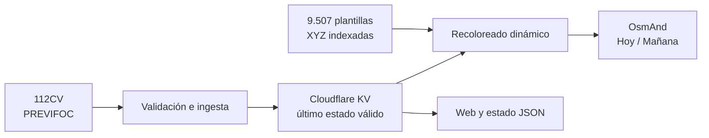

# PREVIFOC para OsmAnd

Capa ráster no oficial para consultar en OsmAnd el nivel diario de riesgo de
incendio forestal PREVIFOC de la Comunitat Valenciana.

El proyecto transforma los datos públicos de 112CV y la geometría municipal
del Institut Cartogràfic Valencià (ICV) en dos fuentes XYZ:

- **PREVIFOC — Hoy (no oficial)**.
- **PREVIFOC — Mañana (previsión)**.

Ambas se instalan mediante un paquete `.osf` y se utilizan como superposición
sobre el mapa vectorial de OsmAnd.

> [!IMPORTANT]
> Este es un servicio independiente y no oficial. No sustituye a 112CV, a las
> autoridades, a las resoluciones vigentes ni a la señalización sobre el
> terreno. La capa aplica un criterio preventivo propio: en el periodo actual,
> el nivel 3 se representa como cierre de pistas y sendas forestales. Los
> niveles 1 y 2 no confirman que una vía esté abierta y la previsión de mañana
> no confirma cierres futuros.

## Servicio público

- Web e instalación: [previfoc.davidramosweb.com](https://previfoc.davidramosweb.com)
- Estado JSON: [previfoc.davidramosweb.com/status.json](https://previfoc.davidramosweb.com/status.json)
- Salud del servicio: [previfoc.davidramosweb.com/health](https://previfoc.davidramosweb.com/health)
- Paquete OsmAnd: [previfoc.osf](https://previfoc.davidramosweb.com/previfoc.osf)
- Fuente oficial: [112CV — Incendios forestales](https://www.112cv.gva.es/es/incendios-forestales)

## Qué hace

1. Obtiene de 112CV los niveles PREVIFOC de hoy y de mañana.
2. Valida el esquema, las siete zonas y las situaciones de riesgo recibidas.
3. Conserva en Cloudflare KV únicamente estados válidos y mantiene el último
   estado correcto si la fuente falla.
4. Recolorea en el borde una pirámide de plantillas PNG indexadas según el
   estado vigente.
5. Sirve las teselas en formato XYZ, la página informativa y el instalador
   `.osf`.



La actualización automática se ejecuta cada hora mediante un Cron Trigger. Las
teselas cubren los niveles de zoom 6–14, usan Web Mercator y siguen el esquema
XYZ —la coordenada Y no está invertida—. OsmAnd las considera caducadas después
de 60 minutos.

## Instalación en OsmAnd

1. Descarga [`previfoc.osf`](https://previfoc.davidramosweb.com/previfoc.osf).
2. Ábrelo con OsmAnd e importa el complemento.
3. En `Configurar mapa → Superposición`, selecciona **PREVIFOC — Hoy (no
   oficial)** o **PREVIFOC — Mañana (previsión)**.
4. Mantén el mapa vectorial de OsmAnd como mapa principal.

En Android puede ser necesario activar antes el complemento **Mapas en línea**.
En iOS, abre el archivo desde Safari o Archivos mediante `Compartir → Abrir con
OsmAnd`.

La guía detallada de instalación y comprobación está en
[`data/osmand-003/INSTALL.md`](data/osmand-003/INSTALL.md).

## Arquitectura actual

El servicio se ejecuta como un único Cloudflare Worker en módulos ES:

- **Static Assets** almacena la web, el paquete `.osf` y las plantillas XYZ.
- **KV** conserva el estado PREVIFOC validado.
- **Cron Trigger** actualiza el estado cada hora.
- **Cache API** guarda las teselas ya recoloreadas por estado y periodo.
- **TypeScript** implementa la ingesta, persistencia, API y transformación PNG.
- **Python** construye y verifica los datos geográficos y los artefactos
  reproducibles.

No se usan R2, D1, Cloudflare Images, un servidor Node persistente ni una base
de datos espacial en producción.

### Rutas públicas

| Ruta | Descripción |
|---|---|
| `/` | Página informativa e instalación |
| `/health` | Salud y vigencia del estado actual |
| `/status.json` | Estado completo de las siete zonas |
| `/previfoc.osf` | Paquete de configuración para OsmAnd |
| `/tiles/current/{z}/{x}/{y}.png` | Teselas del periodo actual |
| `/tiles/forecast-next-day/{z}/{x}/{y}.png` | Teselas de la previsión de mañana |

## Desarrollo local

### Requisitos

- Node.js 24 o una versión compatible con las dependencias fijadas.
- pnpm 10.18.1.
- Python 3.13 para reconstruir todos los artefactos geográficos.
- Una cuenta de Cloudflare solo para probar recursos remotos o desplegar.

### Instalar dependencias

```sh
pnpm install
```

Para trabajar con el pipeline geográfico:

```sh
python3.13 -m venv .venv-geo
.venv-geo/bin/python -m pip install --requirement requirements-geo-004.txt
```

El entorno geográfico incluye NumPy, pyproj, Shapely y Pillow en versiones
fijadas.

### Ejecutar el Worker

```sh
pnpm dev
```

Este comando valida el paquete OsmAnd, prepara los assets públicos y arranca
Wrangler con soporte para probar eventos programados.

## Validación

Validación principal del Worker y del paquete:

```sh
pnpm typecheck
pnpm test
pnpm check:assets
pnpm deploy:dry-run
```

Suite geográfica completa:

```sh
.venv-geo/bin/python -m unittest discover -s tests -v
```

Los controles verifican, entre otros aspectos:

- contratos y fallos de las fuentes externas;
- persistencia atómica del último estado válido;
- siete zonas y 542 municipios asignados de forma biyectiva;
- validez, cobertura, CRS y reproducibilidad geométrica;
- orientación XYZ, transparencia y continuidad entre teselas;
- recoloreado PNG sin decodificación completa;
- caché, ETag, estado obsoleto y fallback seguro;
- contenido, seguridad y reproducibilidad del paquete `.osf`.

## Pipeline geográfico

Los artefactos versionados se construyen en etapas independientes y
reproducibles:

```text
fuentes fijadas
    ↓
crosswalk de 542 municipios
    ↓
7 zonas canónicas
    ↓
comparación con el mapa oficial
    ↓
plantilla PNG indexada
    ↓
pirámide XYZ z6–14
    ↓
paquete OsmAnd y Worker
```

Las herramientas están documentadas en [`tools/README.md`](tools/README.md).
Cada etapa valida las huellas de la anterior antes de producir nuevos
artefactos.

## Estructura del repositorio

```text
config/   contratos y configuración reproducible
data/     snapshots, geometrías, controles y teselas generadas
deploy/   ejemplos y documentación de despliegues auxiliares
scripts/  staging de assets y comprobaciones de publicación
src/      Worker, ingesta, estado y transformación PNG
static/   web pública y paquete OsmAnd
test/     pruebas TypeScript ejecutadas en workerd
tests/    pruebas Python del pipeline geográfico
tickets/  especificaciones y criterios de aceptación
tools/    herramientas geográficas y de empaquetado
```

Los archivos con credenciales o configuración activa local no deben
versionarse. `.dev.vars`, los artefactos de Wrangler y la configuración activa
de túneles están excluidos mediante `.gitignore`.

## Despliegue

Antes de desplegar, autentica Wrangler y configura los secretos necesarios
fuera del repositorio:

```sh
pnpm deploy:dry-run
pnpm deploy
```

`pnpm deploy` reconstruye y valida los assets, despliega el Worker y solicita
una actualización inicial del estado. No añadas tokens a `wrangler.jsonc`, a
los scripts ni a archivos versionados; utiliza secretos de Cloudflare,
variables de entorno, `.dev.vars` o el llavero local.

## Fuentes, atribución y licencias

- Los niveles PREVIFOC proceden de servicios públicos de **112CV —
  Generalitat Valenciana**.
- La geometría deriva de límites municipales del **Institut Cartogràfic
  Valencià**, declarados como **CC BY 4.0 Generalitat**.
- La correspondencia entre municipios y zonas y la geometría PREVIFOC son
  productos derivados de este proyecto, no una cartografía oficial publicada
  por 112CV.
- No se ha localizado una licencia específica publicada para la reutilización
  de los JSON de 112CV. El acceso público no se interpreta aquí como una
  licencia.

Consulta [`DATA_SOURCES.md`](DATA_SOURCES.md) para conocer la procedencia, los
contratos observados y las cuestiones todavía pendientes. El repositorio no
incluye actualmente una licencia general para el código fuente.

## Documentación

- [`ARCHITECTURE.md`](ARCHITECTURE.md): arquitectura de referencia y decisiones
  técnicas.
- [`PLAN.md`](PLAN.md): modelo, requisitos y planificación del MVP.
- [`DATA_SOURCES.md`](DATA_SOURCES.md): inspección de fuentes y procedencia.
- [`OSMAND_COMPATIBILITY.md`](OSMAND_COMPATIBILITY.md): compatibilidad y formato
  de instalación.
- [`DECISIONS.md`](DECISIONS.md): registro de decisiones técnicas.
- [`tickets/README.md`](tickets/README.md): fases y criterios de aceptación.
